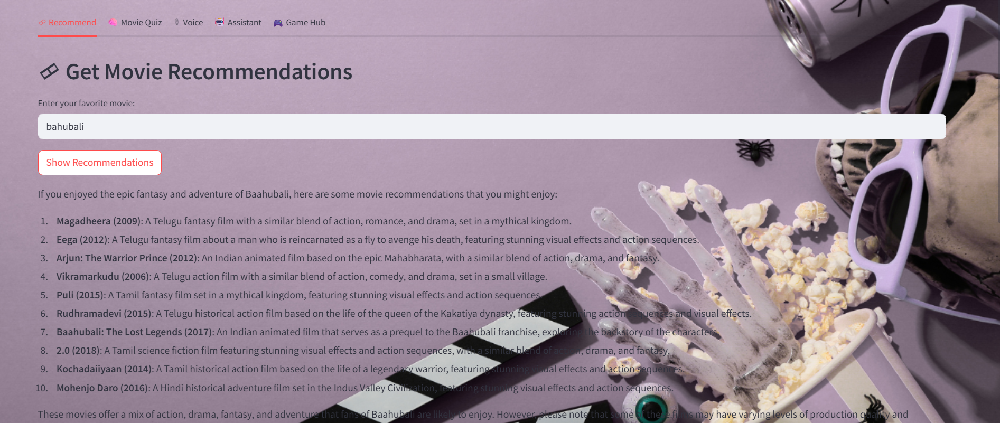
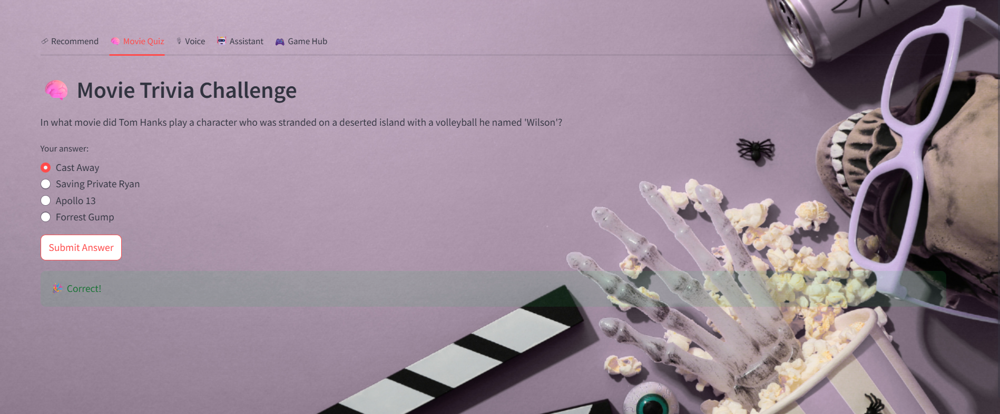
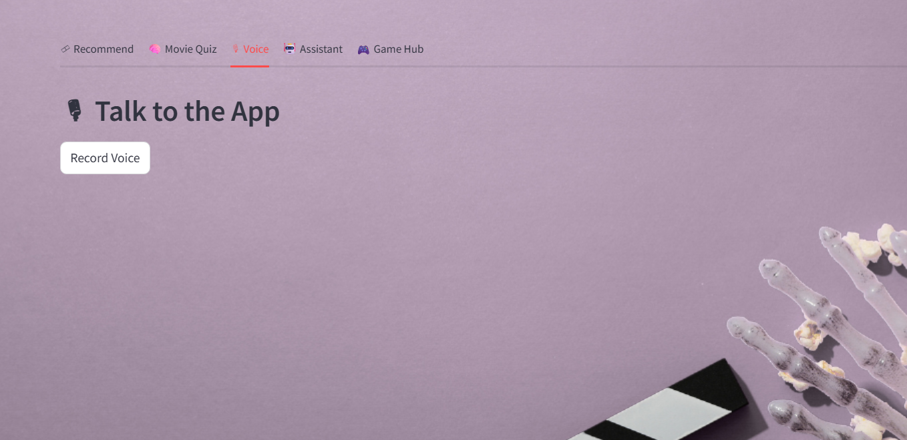
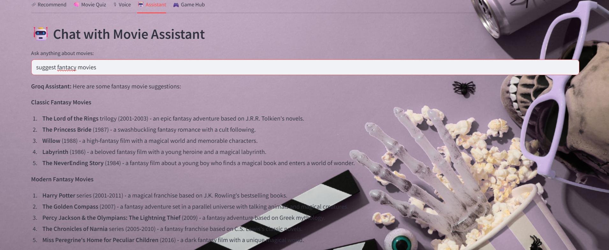
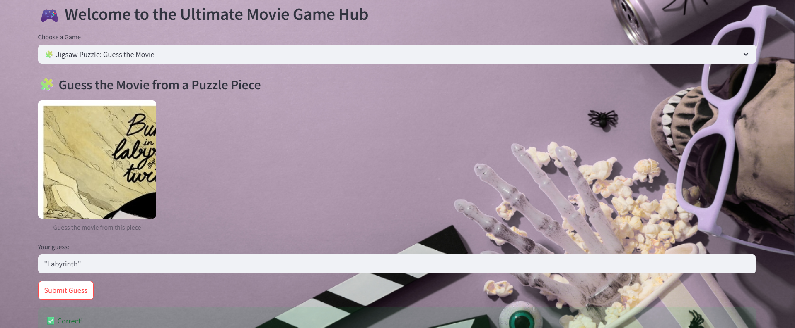
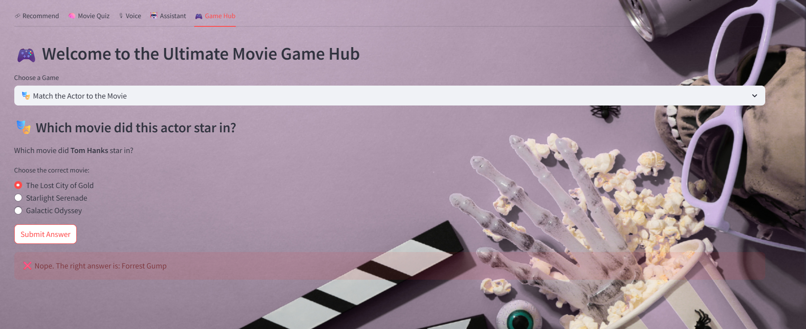
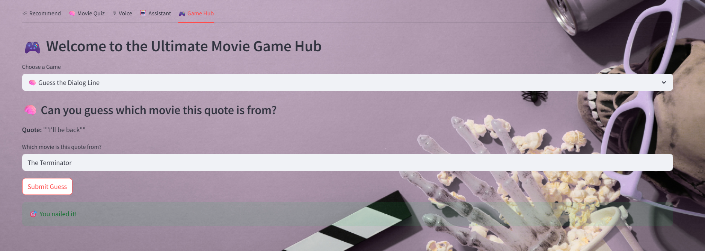
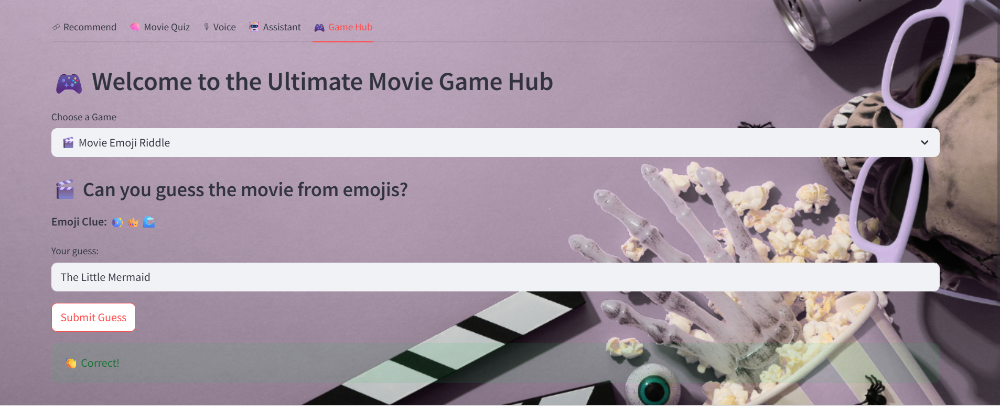
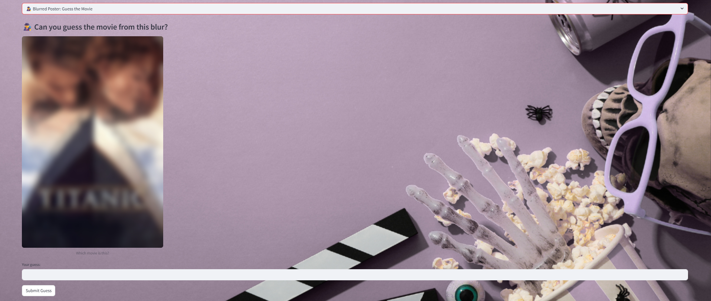

# 🎬 AI Movie Assistant & GameHub

**Your AI-powered movie companion — featuring intelligent recommendations, voice chat, and fun games powered by Groq and TMDb.**

---

## 🧠 Overview

**AI Movie Assistant & GameHub** is an all-in-one Streamlit application that merges movie magic with generative AI. Powered by [Groq LLM](https://groq.com/) and [TMDb API](https://www.themoviedb.org/), it delivers:

- 🎞 Smart movie recommendations  
- 🎮 Interactive movie-themed games  
- 🧠 Movie trivia quizzes  
- 🎙 Voice-based interaction  
- 🤖 Conversational movie assistant

---
## 📷 Screenshots

| Jigsaw Puzzle | Blurred Poster | Emoji Riddle |
|---------------|----------------|--------------|
|  |  |  |
|  |  |  |
|  |  |  |

## ⚙️ Features

| Feature                         | Description                                                                 |
|----------------------------------|-----------------------------------------------------------------------------|
| 🎞 Movie Recommender            | Get AI-powered suggestions based on your favorite films                    |
| 🎮 GameHub                      | Play 5 unique games: Poster blur, jigsaw puzzle, emoji riddles, quote guessing, actor match |
| 🧠 Movie Trivia                 | Fun and educational movie-related quiz questions                           |
| 🤖 AI Movie Assistant           | Ask anything about movies (actors, trivia, genres, history, etc.)          |
| 🎙 Voice Interaction            | Speak to the assistant with voice commands                                 |
| 🎨 Elegant UI                   | Modern Streamlit interface with background visuals                         |

---

## 🛠 Tech Stack

- **Frontend**: [Streamlit](https://streamlit.io/)
- **LLM**: [Groq Inference API](https://console.groq.com/)
- **Movie Data**: [TMDb API](https://www.themoviedb.org/documentation/api)
- **Voice Recognition**: OpenAI Whisper or similar
- **Image Processing**: `Pillow`, `requests`

---

## 🚀 Setup Instructions

### 1. Clone the Repository

Start by cloning the repository to your local machine:

```bash
git clone https://github.com/annie-2314/ai-movie-assistant-gamehub
cd ai-movie-assistant-gamehub
### 2. Install Dependencies

Make sure you have Python installed on your system. Then, install the required dependencies:

```bash
pip install -r requirements.txt
### 3. Set up API Keys

Create a `.env` file in the root of your project directory and add the following keys:

```bash
GROQ_API_KEY=your_groq_api_key
TMDB_API_KEY=your_tmdb_api_key
### 4. Run the Application
Once everything is set up, you can run the application using:

bash
Copy code
streamlit run app.py

This will start the Streamlit app and open it in your browser.

vbnet
Copy code

This is the code snippet format for the **Set up API Keys** and **Run the Appl
## Setup Instructions

1. Clone the repository:

   ```bash
   git clone https://github.com/yourusername/ai-movie-assistant-gamehub.git
   cd ai-movie-assistant-gamehub
   ```

2. Create a virtual environment:

   ```bash
   python -m venv venv
   ```

3. Activate the virtual environment:
   - **On Windows**:
     ```bash
     venv\Scripts\activate
     ```
   - **On macOS/Linux**:
     ```bash
     source venv/bin/activate
     ```

4. Install dependencies from `requirements.txt`:

   ```bash
   pip install -r requirements.txt
   ```

5. Run the Streamlit app:

   ```bash
   streamlit run app.py
   ```

6. Open the provided local URL in your browser to interact with the app.

## API Keys

Don't forget to add your **Groq** and **TMDb API keys** to a `.env` file as described earlier in the repository to authenticate API requests.


💬 **Contributing**

Feel free to fork the repository, make changes, and submit a pull request. If you encounter any issues or have feature suggestions, open an issue on the GitHub repository.

---
📝 **Acknowledgments**

- **Groq LLM** for providing AI-powered content generation.
- **TMDb API** for movie data and metadata.
- **Streamlit** for easy web app development.
- **Pillow** for image processing.

